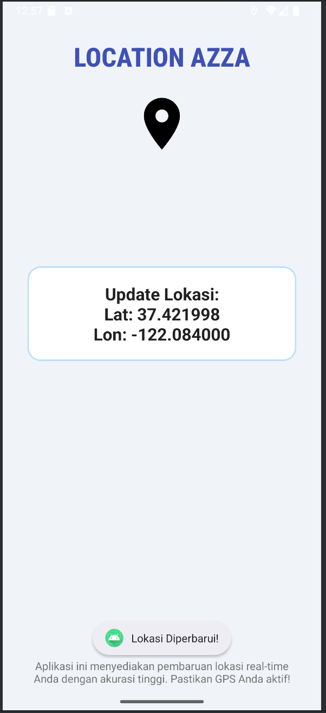

# LOCATION AZZA

[](https://github.com/azza0x1a/Apk-Location-Azza/blob/main/LICENSE)
[](https://github.com/azza0x1a/Apk-Location-Azza/stargazers)
[](https://github.com/azza0x1a/Apk-Location-Azza/network/members)

 Aplikasi Android **LOCATION AZZA** adalah solusi mutakhir untuk melacak dan menampilkan lokasi Anda secara real-time dengan akurasi tinggi. Dibangun dengan Java murni di Android Studio, aplikasi ini memanfaatkan Google Play Services Location API untuk memberikan pengalaman pelacakan lokasi yang mulus dan powerful.


## ✨ Fitur Unggulan

* **Pelacakan Lokasi Akurat**: Menggunakan kombinasi GPS, Wi-Fi, dan jaringan seluler untuk menentukan lokasi paling tepat.
* **Pembaruan Lokasi Real-time**: Secara otomatis memperbarui lokasi Anda dengan interval yang dapat dikonfigurasi.
* **Tampilan Lokasi Intuitif**: Menampilkan koordinat lintang (Latitude) dan bujur (Longitude) dengan format yang mudah dibaca.
* **Permintaan Izin Dinamis**: Mengelola izin lokasi secara efisien pada perangkat Android 6.0 (Marshmallow) ke atas.
* **UI Modern & Responsif**: Antarmuka pengguna yang bersih dan mudah digunakan, dirancang untuk pengalaman pengguna yang optimal.
* **Notifikasi Pengguna**: Memberikan umpan balik (feedback) melalui `Toast` saat lokasi diperbarui atau izin ditangani.

## 🚀 Instalasi & Jalankan Aplikasi

Untuk menjalankan aplikasi ini di perangkat Anda, ikuti langkah-langkah berikut:

1.  **Clone Repository**:
    ```bash
    git clone [https://github.com/azza0x1a/Apk-Location-Azza.git](https://github.com/azza0x1a/Apk-Location-Azza.git)
    ```
2.  **Buka di Android Studio**:
    * Buka Android Studio.
    * Pilih `File` > `Open` dan navigasikan ke folder `Apk-Location-Azza` yang baru saja Anda clone.
3.  **Sinkronkan Gradle**:
    * Biarkan Android Studio menyelesaikan proses sinkronisasi Gradle pertama. Pastikan Anda terhubung ke internet.
4.  **Jalankan di Emulator/Perangkat Fisik**:
    * Sambungkan perangkat Android Anda via USB (pastikan Debugging USB aktif) atau pilih emulator Android.
    * Klik tombol `Run` (ikon segitiga hijau) di toolbar Android Studio.
5.  **Berikan Izin Lokasi**:
    * Saat aplikasi pertama kali diluncurkan, Anda akan diminta untuk memberikan izin lokasi. **Pilih "Allow all the time" atau "While using the app"** untuk fungsionalitas penuh.

## 📸 Tampilan Aplikasi (Screenshots)

Berikut adalah beberapa tampilan aplikasi **LOCATION AZZA** saat beraksi
